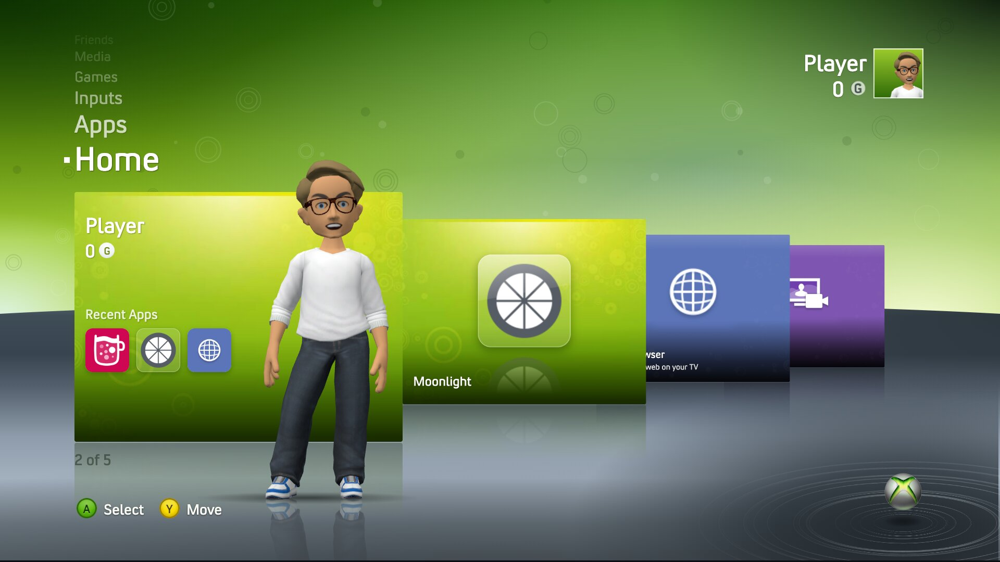
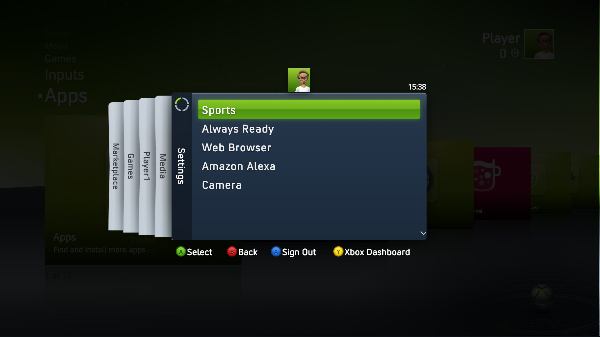
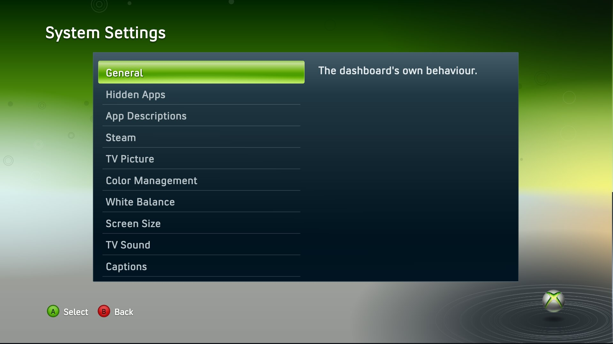

# NXE

A home screen for rooted LG webOS TVs that recreates the look and motion of the late-2008 console dashboard: a column of channels, a row of panes you move along with the remote, a boot sequence, toasts, a Guide overlay, HDMI input previews and a Steam friends list.





It runs from `file://` on the TV, and in desktop Chrome against a mock Luna transport for development. The app ships with an original default theme, and other looks load as theme add-ons (`app/src/theme/`).

## Requirements

- A rooted LG webOS TV, webOS 23 or later (the app needs Chromium 108).
- The [Homebrew Channel](https://www.webosbrew.org/) installed. First launch uses its root shell to finish the install.

## Install

This isn't in the Homebrew Channel repo, so add it as a custom repo:

Add `https://raw.githubusercontent.com/lewisdoesstuff/webos-nxe/main/repo.json` in the Homebrew Channel's repository settings, then install NXE from the app list. Open it: the first run offers the Home button hook, starting at boot, a custom avatar and Steam sign-in, and each can be skipped.

To sideload an IPK instead, build it (below) and run `ares-install --device <name> dist/ooo.lew.nxe_*.ipk`, or follow the `luna-send` steps in [`AGENTS.md`](./AGENTS.md).

## Develop

```bash
bun install
bun run dev      # http://localhost:5173/?boot=off
bun run verify   # check, lint, format and tests
./build.sh       # IPK in dist/ (needs ares-package)
```

Start with [`AGENTS.md`](./AGENTS.md). `./build.sh` needs `ares-package` from [`@webos-tools/cli`](https://www.npmjs.com/package/@webos-tools/cli). Tagging `v*` builds and publishes a release through GitHub Actions.

The Home button hook in `service/home-hook/` is GPL-3.0; everything else is MIT.

## Not affiliated

NXE is not affiliated with Microsoft, LG or Valve. See [`NOTICE.md`](./NOTICE.md).
